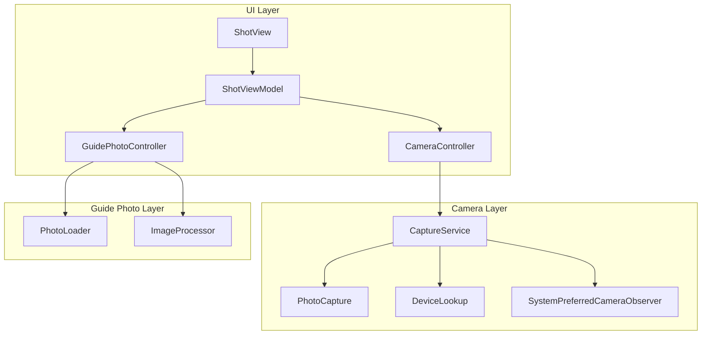
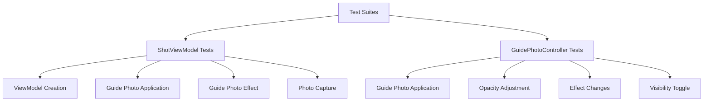

# FlipCam

<h1 align="center">FlipCam</h1>

<h2 align="center">Capture perfect moments with guided photography.</h2>
<h4 align="center">An innovative camera app that helps you take better photos using guide photos and advanced camera controls.</h4>

## Table of Contents
* [Features](#Features)
* [Architecture](#Architecture)
* [Requirements](#Requirements)
* [Test Plan](#Test-Plan)
* [Contact](#Contact)

## Features

### Camera Controls
- **Dual Camera Support**: Switch between front and back cameras seamlessly
- **Advanced Focus & Exposure**: Tap to focus and adjust exposure
- **Flash Control**: Multiple flash modes (On, Off, Auto)
- **Zoom Control**: Smooth zoom functionality with precise control
- **Grid Guide**: Toggle grid overlay for better composition

### Guide Photo System
- **Photo Overlay**: Apply guide photos to help with composition
- **Opacity Control**: Adjust guide photo transparency
- **Visual Effects**: Multiple effects for guide photo display
- **Visibility Toggle**: Show/hide guide photos instantly

## Architecture

### Component Diagram

### Architecture Overview

FlipCam follows a clean MVVM architecture with clear separation of concerns:

#### UI Layer
- **ShotView**: Main SwiftUI view handling user interface
- **ShotViewModel**: Coordinates between UI and business logic
- **GuidePhotoController**: Manages guide photo functionality
- **CameraController**: Handles camera operations

#### Camera Layer
- **CaptureService**: Main coordinator for camera operations
- **PhotoCapture**: Handles photo capture process
- **DeviceLookup**: Manages camera device discovery and selection
- **SystemPreferredCameraObserver**: Monitors system camera preferences

#### Guide Photo Layer
- **PhotoLoader**: Handles guide photo loading
- **ImageProcessor**: Processes and applies effects to guide photos

### Key Design Patterns
- **MVVM**: Separates UI logic from business logic
- **Protocol-Oriented**: Enables flexible component composition
- **Dependency Injection**: Facilitates testing and modularity
- **Observer Pattern**: Handles real-time updates
- **Async/Await**: Modern concurrency handling
- **SwiftUI Integration**: Modern UI framework implementation

## Requirements
- iOS 18.0
- Xcode 16.0
- Swift 5

## Test Plan

### Overview
FlipCam's test suite ensures the reliability and functionality of the app's core features. The tests are organized into two main test suites that cover the essential components of the application.

### Test Structure

### Test Suites

#### 1. ShotViewModel Tests
The ShotViewModel test suite verifies the core functionality of the main view model that coordinates between the camera and guide photo features.

- **ViewModel Creation**: Ensures proper initialization of the view model with required components
- **Guide Photo Application**: Validates the ability to apply and process guide photos
- **Guide Photo Effect**: Tests the functionality of applying different effects to guide photos
- **Photo Capture**: Verifies the photo capture functionality through the view model

#### 2. GuidePhotoController Tests
The GuidePhotoController test suite focuses on the specific functionality of managing guide photos.

- **Guide Photo Application**: Tests the loading and application of guide photos
- **Opacity Adjustment**: Verifies the ability to adjust guide photo transparency
- **Effect Changes**: Tests the application of different visual effects to guide photos
- **Visibility Toggle**: Ensures proper toggling of guide photo visibility

### Testing Approach
- Tests are written using Swift's modern testing framework
- Mock objects are used to isolate components and ensure reliable testing
- Asynchronous operations are properly handled with async/await
- Each test focuses on a specific functionality to maintain clarity and maintainability

## Contact
Astrid Lin - tingan.l1216@gmail.com
