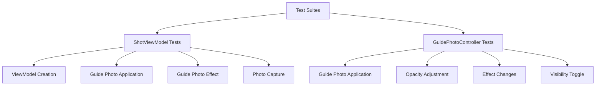

# FlipCam

## Test Plan

### Overview
FlipCam's test suite is designed to ensure the reliability and functionality of the app's core features. The tests are organized into two main test suites that cover the essential components of the application.

### Test Structure

### Test Suites

#### 1. ShotViewModel Tests
The ShotViewModel test suite verifies the core functionality of the main view model that coordinates between the camera and guide photo features.

- **ViewModel Creation**: Ensures proper initialization of the view model with required components
- **Guide Photo Application**: Validates the ability to apply and process guide photos
- **Guide Photo Effect**: Tests the functionality of applying different effects to guide photos
- **Photo Capture**: Verifies the photo capture functionality through the view model

#### 2. GuidePhotoController Tests
The GuidePhotoController test suite focuses on the specific functionality of managing guide photos.

- **Guide Photo Application**: Tests the loading and application of guide photos
- **Opacity Adjustment**: Verifies the ability to adjust guide photo transparency
- **Effect Changes**: Tests the application of different visual effects to guide photos
- **Visibility Toggle**: Ensures proper toggling of guide photo visibility

### Testing Approach
- Tests are written using Swift's modern testing framework
- Mock objects are used to isolate components and ensure reliable testing
- Asynchronous operations are properly handled with async/await
- Each test focuses on a specific functionality to maintain clarity and maintainability
